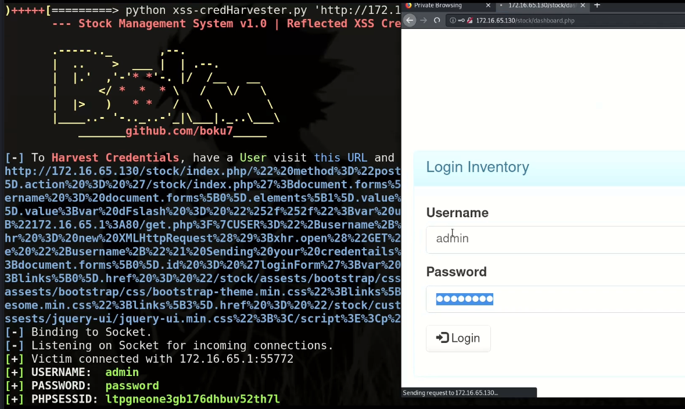

## Stock Management System v1.0 - Cross-Site Scripting Credential Harvester (Login-Portal)
##### Exploit Author: Bobby Cooke (boku) & Adeeb Shah (@hyd3sec)

##### Vulnerability Statistics
+ OWASP Top Ten 2017: A7:2017-Cross-Site Scripting (XSS)
+ CWE-79: Improper Neutralization of Input During Web Page Generation ('Cross-site Scripting') - Type 1: Reflected XSS 
+ CWE-523: Unprotected Transport of Credentials
+ CVSS Base Score: 6.4 
+ Impact Subscore: 4.7 
+ Exploitability Subscore: 1.6
+ CVSS v3.1 Vector: 
  - AV:N/AC:H/PR:N/UI:R/S:U/C:H/I:L/A:L
### Vulnerability Description:
+ Reflected Cross-Site Scripting (XSS) vulnerability in 'index.php' login-portal webpage of SourceCodesters Stock Management System v1.0 allows remote attackers to harvest login credentials & session cookie via unauthenticated victim clicking malicious URL and entering credentials.
### Vendor Info
+ Vendor Homepage: https://www.sourcecodester.com/php/14366/stock-management-system-php.html
+ Software Link: https://www.sourcecodester.com/sites/default/files/download/Warren%20Daloyan/stock.zip

